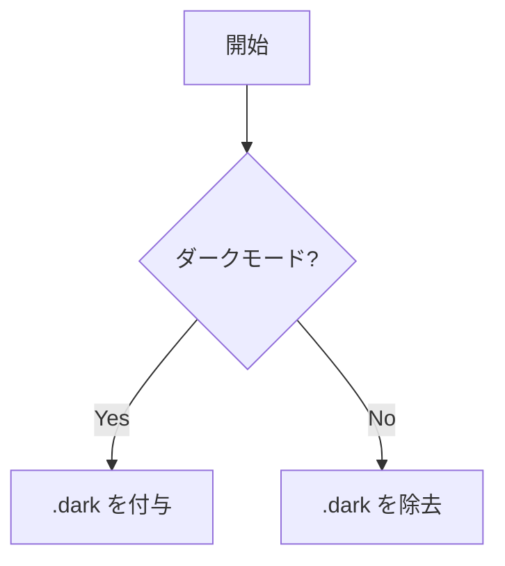

この記事は **GitHub Flavored Markdown (GFM)** の機能をひと通り並べた確認用サンプルです。remark-gfm が扱う範囲（表・打ち消し線・タスクリスト・自動リンク・脚注）と、CommonMark の各機能、そして GitHub 独自拡張（alert / 絵文字 / 数式 / mermaid）に分けて記載しています。

<!-- このコメントが出力に残るかどうかも確認ポイント -->

## 1. 見出し（ATX）

# H1 見出し

## H2 見出し

### H3 見出し

#### H4 見出し

##### H5 見出し

###### H6 見出し

## 2. 見出し（Setext）

# Setext レベル 1

## Setext レベル 2

## 3. 段落・改行

これは段落です。連続した行はひとつの段落にまとめられます（ソフトブレーク）。

行末にバックスラッシュを置くと強制改行になります。\
この行は改行されているはずです。

行末に半角スペース 2 つでも改行になります。  
この行も改行されているはずです。

## 4. 強調・打ち消し

- _イタリック_（アスタリスク）と _イタリック_（アンダースコア）
- **太字**（アスタリスク）と **太字**（アンダースコア）
- **_太字イタリック_**
- ~~打ち消し線~~（GFM 拡張）
- `インラインコード`

## 5. 引用（ネスト）

> これは引用です。複数行にまたがります。
>
> > ネストした引用。
> >
> > > さらに深いネスト。

## 6. リスト

### 6.1 箇条書き（マーカー違い）

- ハイフン

* アスタリスク

- プラス

### 6.2 番号付き

1. 一番目
2. 二番目
3. 三番目
   1. ネストした番号付き
   2. その 2

### 6.3 ネスト混在

- 親
  - 子
    - 孫
  - 子その 2
    1. 番号付きの孫
    2. その 2

### 6.4 タスクリスト（GFM 拡張）

- [x] 完了したタスク
- [ ] 未完了のタスク
- [ ] ~~取り消されたタスク~~
  - [x] ネストした完了タスク

## 7. コード

インラインの `const x = 1;` と、言語付きフェンスコードブロック:

```ts
type Theme = "light" | "dark";

function toggle(current: Theme): Theme {
  return current === "dark" ? "light" : "dark";
}
```

```bash
pnpm install
pnpm build
```

```json
{
  "name": "masterbelt.github.io",
  "private": true
}
```

言語指定なしのフェンス:

```
言語指定のないコードブロック。
そのまま等幅で表示されるはず。
```

インデント（半角スペース 4 つ）によるコードブロック:

    indented code block
    second line

## 8. 表（GFM 拡張・桁揃え）

| 左寄せ      |   中央寄せ    |        右寄せ |
| :---------- | :-----------: | ------------: |
| apple       |      赤       |           100 |
| banana      |      黄       |            42 |
| `code` セル | **強調** セル | ~~取消~~ セル |

## 9. リンク

- インライン: [masterbelt のトップ](https://masterbelt.dev/)
- タイトル付き: [GitHub](https://github.com "GitHub のトップ")
- 参照リンク: [Next.js のサイト][nextjs]
- 折りたたみ参照: [Velite][]
- ショートカット参照: [Tailwind]
- 自動リンク（GFM literal）: https://example.com と www.example.com
- メール自動リンク: support@example.com
- 山括弧オートリンク: <https://example.org>

[nextjs]: https://nextjs.org
[Velite]: https://velite.js.org
[Tailwind]: https://tailwindcss.com

## 10. 画像


## 11. 水平線

直下に 3 種類の水平線を置きます。

---

---

---

## 12. インライン HTML / エンティティ

- キー操作: <kbd>Ctrl</kbd> + <kbd>C</kbd>
- 下付き: H<sub>2</sub>O / 上付き: x<sup>2</sup>
- ハイライト: <mark>マークされたテキスト</mark>
- 略語: <abbr title="HyperText Markup Language">HTML</abbr>
- エンティティ: &copy; 2026 masterbelt &mdash; 矢印 &#8594;
- エスケープ: \*これはイタリックにならない\* / \`バッククォート\`

<details>
<summary>クリックで開閉する詳細（details/summary）</summary>

中身のコンテンツ。**Markdown** もここで効くかを確認します。

- リスト項目 1
- リスト項目 2

</details>

## 13. 脚注（GFM 拡張）

本文中の脚注参照[^1] と、もう一つの脚注[^note]。

[^1]: これは脚注の本文です。

[^note]: 脚注は複数行も可能。

    インデントすると同じ脚注に続けられます。

---

# GitHub 独自拡張（remark-gfm の範囲外）

ここから下は **GitHub では描画されるが remark-gfm 単体では未対応** の機能です。現状のパイプラインでは「素の Markdown / プレーンテキストのまま」になる想定で、何が足りないかの確認用です。

## 14. Alert / Admonitions

> [!NOTE] これは NOTE アラート。

> [!TIP] これは TIP アラート。

> [!IMPORTANT] これは IMPORTANT アラート。

> [!WARNING] これは WARNING アラート。

> [!CAUTION] これは CAUTION アラート。

## 15. 絵文字ショートコード

:tada: :rocket: :+1: :sparkles:

（remark-emoji 未導入なら、上の `:tada:` 等はそのまま文字列で表示されます）

## 16. 数式

インライン数式: $E = mc^2$

ブロック数式:

$$
\int_0^\infty e^{-x^2}\,dx = \frac{\sqrt{\pi}}{2}
$$

（remark-math + KaTeX/MathJax 未導入なら、`$...$` はそのまま表示されます）

## 17. Mermaid 図



（mermaid レンダラ未導入なら、上はただのコードブロックとして表示されます）

## 18. コードハイライト（tree-sitter）

masterbelt（自作言語・自作 grammar）:

```masterbelt
/// A doc comment.
pub type Color = { channel: nint } impl {
  pub fn make(value: nint): Color {
    return Color{ channel: value } // a line comment
  }
}

pub enum Tier {
  Bronze, Silver
}
```

TypeScript（日本語コメント/文字列でズレが出ないかも確認）:

```ts
// 日本語コメント: 設定を読み込む
const greeting: string = "こんにちは, 世界";
function add(a: number, b: number): number {
  return a + b; // sum
}
```

Go:

```go
package main

import "fmt"

func main() {
	msg := "hi"
	fmt.Println(msg)
}
```

C#:

```csharp
class Greeter {
    public string Hello(string name) => $"Hi {name}";
}
```

TOML:

```toml
[server]
host = "localhost"
port = 8080
```

拡張機能（行番号 / `{2}` 行ハイライト / タイトル / `[!code ...]` マーカー）:

```ts {2} :line-numbers [demo.ts]
const a = 1;
const b = 2;
function focused() {} // [!code focus]
const removed = 0; // [!code --]
const added = 1; // [!code ++]
throw new Error("boom"); // [!code error]
console.warn("careful"); // [!code warning]
const hl = true; // [!code highlight]
```

コードグループ（タブ）:

:::code-group

```ts [config.ts]
export const port = 8080;
```

```go [config.go]
package config

const Port = 8080
```

```toml [config.toml]
port = 8080
```

:::
